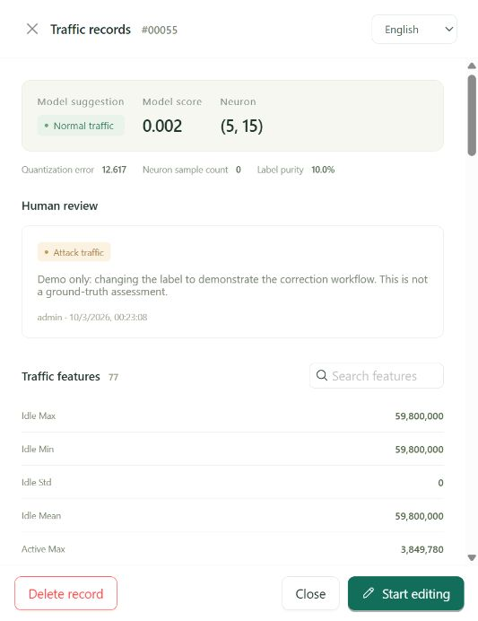
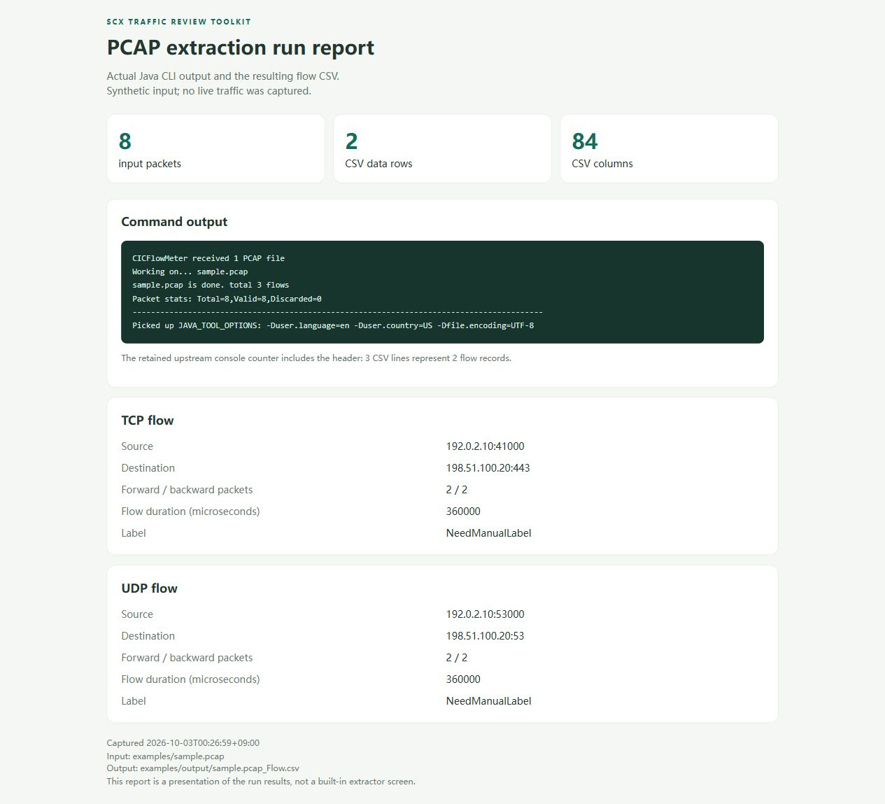
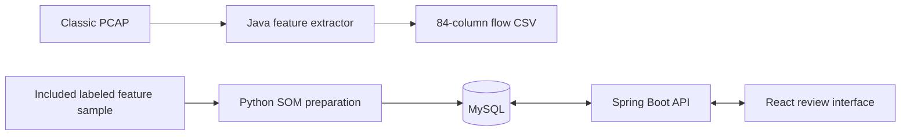

# SCX Traffic Review Toolkit

A Java PCAP feature extractor and a full-stack application for reviewing SOM-generated traffic labels.

The repository contains two independently runnable tools:

| Directory | Purpose | Main technologies |
| --- | --- | --- |
| [pcap-extractor](pcap-extractor/pcap2csv/README.md) | Convert classic PCAP files into bidirectional flow features | Java 8, CICFlowMeter, jNetPcap, Gradle |
| [review-webapp](review-webapp/README.md) | Generate candidate labels offline and review them in a browser | Python, MiniSom, Java 21+, Spring Boot, Spring Security, MySQL, React, TypeScript |
| [screenshots](screenshots/README.md) | Screenshots and descriptions of actual local runs | English UI |

The review interface supports **English, Japanese, and Chinese**. Source comments, documentation, and repository filenames use English. Translated UI strings are kept in the translation catalog.

## Runtime preview

| Human review | PCAP extraction report |
| --- | --- |
|  |  |

See [all screenshots and run details](screenshots/README.md). The PCAP image is a report of actual command output and CSV data; the extractor itself is a CLI.

## What the tools do



The extractor produces features and a `NeedManualLabel` placeholder. The web demo uses a separately prepared feature dataset and labeled seed rows. Importing arbitrary extractor output requires a compatible feature mapping and labeled seed data; the tools do not perform that conversion automatically.

## Start the web application on Windows

Prerequisites: Windows x64, JDK 21 or newer, Maven 3.9, Python 3.12, and an internet connection for the initial dependency download.

```powershell
cd review-webapp
powershell -NoProfile -ExecutionPolicy Bypass -File .\setup.ps1 -PythonExecutable 'C:\path\to\python.exe'
powershell -NoProfile -ExecutionPolicy Bypass -File .\start.ps1
```

Open **http://127.0.0.1:8088**. Setup creates random passwords for `admin` and `reviewer` in `review-webapp/.local/accounts.txt`. The database uses local port `3307` by default. Both ports can be changed in the generated `.env` file before startup.

The web application supports login/logout, role-based permissions, filtering and pagination, review notes, label corrections, administrator soft deletion, and five-minute edit leases. Its frontend is built and served by Spring Boot, so a separate frontend server is unnecessary for the demo.

See [web setup and architecture](review-webapp/README.md) for details.

## Run PCAP feature extraction

The extractor uses **JDK 8**, independently of the web application's JDK 21+ requirement. Windows also needs a compatible WinPcap/Npcap installation. Set the extractor terminal's `JAVA_HOME` and `PATH` to JDK 8.

```powershell
cd pcap-extractor
python .\examples\generate_sample.py
powershell -NoProfile -ExecutionPolicy Bypass -File .\pcap2csv\build.ps1
powershell -NoProfile -ExecutionPolicy Bypass -File .\pcap2csv\run.ps1 -InputPath .\examples\sample.pcap -OutputDirectory .\examples\output
```

The example is synthetic and uses reserved documentation addresses. Its output is `examples/output/sample.pcap_Flow.csv`. The 84 columns include identifiers and a label column; they are not 84 model input features.

See [extractor instructions](pcap-extractor/pcap2csv/README.md) and [follow mode](pcap-extractor/pcap2csv/FOLLOW.md).

## Review workflow

1. The offline Python job fits a SOM on 1,000 labeled seed rows from the included 5,000-row sample.
2. It creates 4,000 candidate labels with neuron information and a heuristic review score.
3. A reviewer signs in, filters records, and opens a record's feature details.
4. Starting an edit acquires a five-minute lease. The reviewer can confirm or correct the label and save a reason.
5. The application stores model and human labels separately. Saving or cancelling releases the lease.

The score orders the review queue; it is not a calibrated probability. A saved review is a human decision, not automatically a verified ground-truth label. This project does not automatically retrain XGBoost from web reviews.

## Data and attribution

The bundled web sample was selected reproducibly from a supplied local SCX dataset. It contains `BENIGN`, `DDoS`, and `Syn` source labels. It is not presented as an unmodified official CIC dataset release. See [sample provenance](review-webapp/data/sample-info.json).

The extractor compiles the pinned CICFlowMeter feature pipeline instead of reimplementing its formulas. Its original license and dependency notices are retained. See [third-party notices](THIRD_PARTY_NOTICES.md).

This is a local research and interview demonstration. Deployment hardening, full review history, and automated retraining are outside its current scope.
