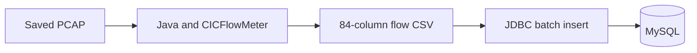
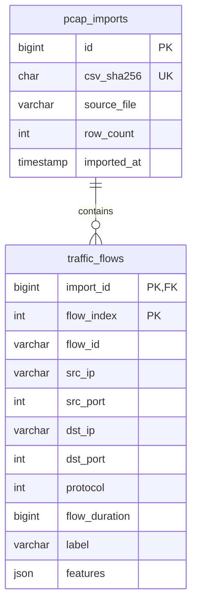
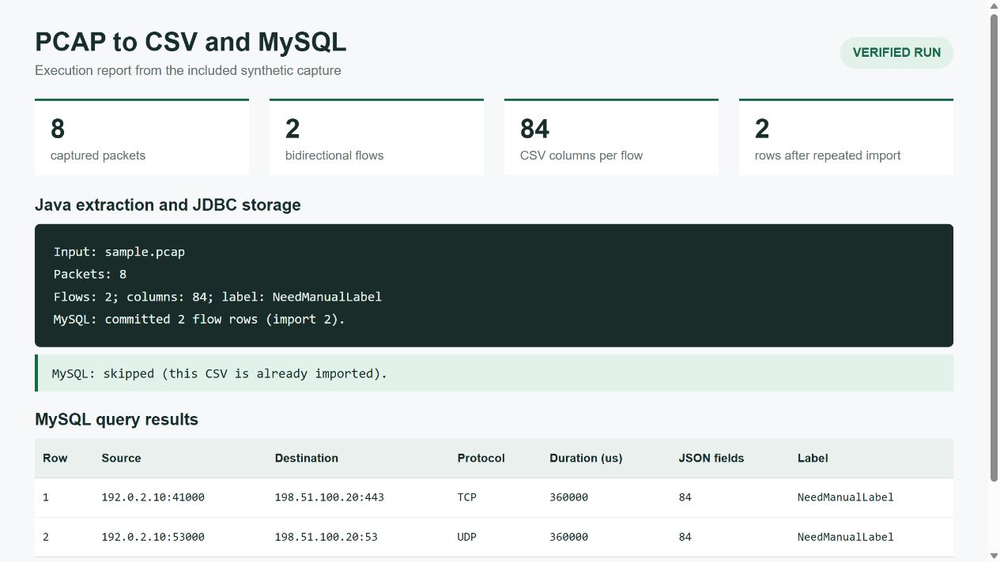

# PCAP to CSV, MySQL, and SCX

A small Java program for preparing network traffic data for research. It reads a saved PCAP file, calculates bidirectional flow statistics with the CICFlowMeter core, writes an 84-column CSV, and optionally stores the same records in MySQL.

The [`scx/`](scx/README.md) folder contains the separate Python research program that generates SOM pseudo-labels and retrains XGBoost. Research datasets are kept local.



The label is `NeedManualLabel`. This program extracts features; it does not classify attacks or run SOM/XGBoost. The 84 columns include identifiers, timestamps, and a label, so they are not 84 independent model features.

## Source layout

All Java sources are directly visible in `src/`. No source archive or extraction step is required.

```text
cording88/
  src/
    PcapToCsv.java
    MySqlStore.java
    PacketReader.java
    BasicPacketInfo.java
    FlowGenerator.java
    BasicFlow.java
    FlowFeature.java
    DateFormatter.java
    IdGenerator.java
    Protocol.java
    Utils.java
    FlowGenListener.java
  lib/jnetpcap/           Native JAR, DLLs, and license notices
  scx/
    SCX.py
    requirements.txt
    README.md
  examples/
  screenshots/
  build.ps1
  run.ps1
  mysql.example.properties
```

Start with these application entry points:

| File | Responsibility |
| --- | --- |
| [`src/PcapToCsv.java`](src/PcapToCsv.java) | Validate a saved capture, group packets into flows, write CSV, and call database storage. |
| [`src/MySqlStore.java`](src/MySqlStore.java) | Create tables, validate generated CSV records, batch inserts, prevent duplicate imports, and commit or roll back. |
| [`src/PacketReader.java`](src/PacketReader.java) | Read packets through jNetPcap. |
| [`src/FlowGenerator.java`](src/FlowGenerator.java) | Group packets into bidirectional flows. |
| [`src/BasicFlow.java`](src/BasicFlow.java) | Calculate flow features and serialize a CSV row. |
| [`src/FlowFeature.java`](src/FlowFeature.java) | Define the feature names and CSV header. |
| [`scx/SCX.py`](scx/SCX.py) | Run the separate SOM and XGBoost research experiment on a labeled local CSV. |

Other files are supporting material:

| File | Purpose |
| --- | --- |
| `run.ps1` | Build and run on Windows. |
| `build.ps1` | Download checksum-pinned Maven dependencies and compile all Java files directly from `src/`. |
| `mysql.example.properties` | Database configuration template. |
| `lib/jnetpcap/` | jNetPcap for Windows x64 and its original license notices. |
| `LICENSE-CICFlowMeter.txt` | The original CICFlowMeter copyright and MIT license notice. |
| `examples/sample.pcap` | Synthetic eight-packet capture with two flows; contains no private traffic. |
| `examples/query.sql` | Example SQL queries. |
| `screenshots/` | A run report showing actual extraction and MySQL results. |
| `THIRD_PARTY_NOTICES.md` | Attribution, versions, and license locations. |

Generated classes, downloaded Maven dependencies, output CSV files, and local credentials stay outside Git. The ten CICFlowMeter source files are preserved with their original package declarations and feature formulas. `javac` compiles the flat source directory and places compiled classes into their package folders under `.local/classes`. Builds do not overwrite the editable files in `src/`. The wrapper uses two narrowly scoped reflective accesses to flush remaining flows and close the native reader because the pinned upstream API does not expose these operations.

For the Python program, see [`scx/README.md`](scx/README.md). Its current configuration and input schema are documented there. The Java extractor and SCX run separately; the repository does not automatically train a model from the MySQL tables.

## Requirements

- Windows x64 and **JDK 8 x64**. A JRE alone cannot compile the sources.
- A WinPcap-compatible Windows packet-capture runtime. The native library needs its DLLs even when reading saved files. This checkout was verified on the existing Windows capture runtime. Other operating systems and native-library versions are not verified by this simplified package.
- Internet access for the first build. Subsequent builds reuse `.local/lib`.
- **MySQL 8.4** when database storage is enabled. CSV-only conversion needs no database.

The supported input is a **complete classic PCAP 2.4 file with microsecond timestamps and Ethernet frames**. The retained reader uses IPv4. PCAPNG, live capture, tailing a growing file, and IPv6 extraction are outside this version's scope. Upstream end-of-file behavior omits remaining one-packet flows. PCAP structural validation runs before native parsing.

## 1. Generate CSV

Open PowerShell in this repository. Use the process-only execution-policy option if Windows blocks local scripts:

```powershell
powershell -NoProfile -ExecutionPolicy Bypass -File .\run.ps1 -JavaHome 'C:\path\to\jdk8'
```

The JDK path is remembered locally. To process your own capture:

```powershell
powershell -NoProfile -ExecutionPolicy Bypass -File .\run.ps1 -InputPath 'D:\captures\traffic.pcap' -OutputDirectory '.\output'
```

The bundled sample produces **2 data rows and 84 columns** in `output/sample.pcap_Flow.csv`. Timestamps use UTC. A new conversion replaces the output CSV with the same filename after extraction succeeds. Each invocation handles one file and exits.

## 2. Enable MySQL storage

Start your MySQL server. Run this once as a database administrator, substituting a private password:

```sql
CREATE DATABASE pcap_features CHARACTER SET utf8mb4 COLLATE utf8mb4_0900_ai_ci;
CREATE USER 'pcap_user'@'127.0.0.1' IDENTIFIED BY 'REPLACE_WITH_YOUR_PASSWORD';
GRANT CREATE, SELECT, INSERT, UPDATE, DELETE, REFERENCES
  ON pcap_features.* TO 'pcap_user'@'127.0.0.1';
```

Copy the configuration template and edit the URL, port, username, and password:

```powershell
Copy-Item .\mysql.example.properties .\mysql.properties
notepad .\mysql.properties
```

`mysql.properties` is excluded from Git. Store the password there, not in command arguments. Java properties treat backslashes as escapes; write a literal backslash as `\\`. The example requires TLS on the local MySQL server. For a remote server, configure its trusted CA and use `sslMode=VERIFY_IDENTITY`.

Run the complete pipeline:

```powershell
powershell -NoProfile -ExecutionPolicy Bypass -File .\run.ps1 -InputPath .\examples\sample.pcap -MysqlConfig .\mysql.properties
```

Expected final message on the first run:

```text
MySQL: committed 2 flow rows (import 1).
```

Run the same command again and it reports that this CSV is already imported. To inspect the data, execute `examples/query.sql` in your MySQL client.

## Database design



- **Complete records:** `features` stores all 84 original column names and values as JSON strings. This preserves upstream values such as `NaN` without producing invalid JSON. Common query fields also have typed SQL columns; duration is in microseconds. The original timestamp is retained in JSON.
- **Batch writes:** JDBC sends records in batches of 500 using prepared statements.
- **Atomic import:** one transaction covers the import record and all of its flow rows. A failure rolls back the entire file's database changes. Table creation runs before this transaction because MySQL DDL commits implicitly.
- **Duplicate prevention:** a unique SHA-256 of the CSV prevents importing identical CSV bytes twice. This is file-level deduplication, not semantic deduplication of different captures with overlapping flows. UTC and a fixed English locale keep sample output stable across runs.
- **CSV remains available:** a database failure leaves the successfully generated CSV on disk and returns a nonzero exit status. Fix the connection and rerun the command.
- **CSV parser scope:** the database code accepts the exact CSV format generated by this extractor, whose fields do not include embedded commas or newlines. It is not a general CSV import tool.

## Demonstration and limits

The screenshot was generated from real console output and SQL query results using the synthetic sample. It shows two stored flows, 84 JSON fields per row, and an unchanged row count after a repeated import. It is a formatted execution report.



This is an offline research utility. The pinned native extraction library is old and has its own parsing and flow semantics. Process trusted saved captures and review the feature definitions before using the output in a different dataset or model. The program does not connect the database to a training loop automatically.

## References

- [CICFlowMeter source](https://github.com/ahlashkari/CICFlowMeter/tree/98a5ebad0df579cc8b43eedd3421b3ae87699901)
- [MySQL Connector/J batch options](https://dev.mysql.com/doc/connector-j/en/connector-j-connp-props-performance-extensions.html)
- [MySQL Connector/J TLS configuration](https://dev.mysql.com/doc/connector-j/en/connector-j-reference-using-ssl.html)
