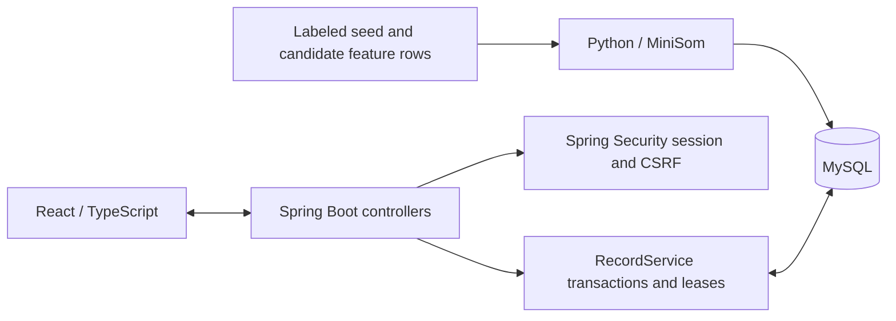

# SCX Review

A small application for inspecting and correcting SOM-generated network traffic labels. English, Japanese, and Chinese can be selected on the login screen, dashboard, and record drawer. English is the default for a new browser profile; the selected language is remembered locally.

## Requirements

- Windows x64
- JDK 21 or newer, available through `JAVA_HOME`
- Maven 3.9, with `mvn.cmd` on `PATH`
- Python 3.12
- Internet access for the first setup

Setup installs Node and MySQL into `.tools`, creates a Python virtual environment, initializes a dedicated local database, builds the frontend/backend, and computes the sample's SOM predictions. Dependency downloads require several GB of free disk space. MySQL may also require the Microsoft Visual C++ runtime on a clean Windows installation.

## First run

Run from this directory:

```powershell
powershell -NoProfile -ExecutionPolicy Bypass -File .\setup.ps1 -PythonExecutable 'C:\path\to\python.exe'
powershell -NoProfile -ExecutionPolicy Bypass -File .\start.ps1
```

Open **http://127.0.0.1:8088**. Credentials are generated locally in `.local/accounts.txt`:

| Account | Role | Permissions |
| --- | --- | --- |
| `admin` | `ADMIN` | Browse, review, and soft-delete records |
| `reviewer` | `REVIEWER` | Browse and review records |

There is no shared default password. The real `.env`, accounts file, database, and installed runtimes are ignored by Git. `.env.example` documents the settings without including credentials.

If port `8088` or `3307` is already occupied, create `.env` using `.env.example`, set random passwords, and choose unused `APP_PORT` and `DB_PORT` values before setup. Do not copy the example password placeholders as real credentials.

Stop the application's own processes:

```powershell
powershell -NoProfile -ExecutionPolicy Bypass -File .\stop.ps1
```

The stop script verifies process identity and checks that both configured ports are closed. A previously loaded browser page may remain visible until it is refreshed.

## Development commands

Rebuild after changing the frontend or backend:

```powershell
powershell -NoProfile -ExecutionPolicy Bypass -File .\stop.ps1
powershell -NoProfile -ExecutionPolicy Bypass -File .\build.ps1
powershell -NoProfile -ExecutionPolicy Bypass -File .\start.ps1
```

Recompute and import candidates:

```powershell
powershell -NoProfile -ExecutionPolicy Bypass -File .\prepare-data.ps1
```

Run model computation without a database:

```powershell
.\.venv\Scripts\python.exe .\model\prepare_data.py --output-only
```

Repeating the same import preserves existing reviews and deletions. The importer rejects a different model version in an already populated database; use a separate database for a different dataset or model configuration.

## Architecture



| Part | Responsibility |
| --- | --- |
| `frontend/src/App.tsx` | Login, review queue, record drawer, lease countdown, and label editing |
| `frontend/src/api.ts` | HTTP requests, session handling, and CSRF headers |
| `frontend/src/i18n.tsx` | Language selection, date/number formatting, and localized API errors |
| `frontend/src/translations.ts` | English message keys with English/Japanese/Chinese UI translations |
| `backend/.../SecurityConfig.java` | Session login, logout, CSRF protection, and request authorization |
| `backend/.../RecordService.java` | Validated queries, edit leases, review saves, and administrator deletion |
| `backend/src/main/resources/schema.sql` | Users and traffic record tables |
| `model/prepare_data.py` | Preprocessing, SOM fitting, candidate generation, and idempotent import |
| `scripts/` | Local configuration, database initialization, and runtime downloads |

Spring Boot serves the compiled React files and the `/api` endpoints from one origin. Passwords use BCrypt. Sessions expire after 30 minutes of inactivity. The session cookie is HttpOnly and SameSite=Strict; `COOKIE_SECURE` is configurable for an HTTPS deployment.

## Edit leases

Starting an edit takes a short database row lock, checks the existing lease, and returns a fresh record with a random lease token. The browser can edit for five minutes. Saving requires the same user and token before expiry. Saving, cancelling, or logging out releases the lease. If the browser closes unexpectedly, the lease expires automatically.

The database transaction does not stay open while a reviewer edits. A stale cancellation cannot release another editor's newer lease. The application stores the latest review, reviewer, timestamp, and note, but does not keep a complete revision history.

## Model and sample

The included `data/cic-sample.csv` has 5,000 rows and 77 numeric traffic features, plus a source-row identifier and source label. A fixed split uses 1,000 labeled seed rows and treats the other 4,000 rows as candidates. Imputation and scaling are fitted only on the seed subset.

The SOM maps records to neurons. Seed-label votes determine neuron labels. The review score combines label purity and quantization error, with a penalty for sparsely supported neurons. All candidate records are retained so that a reviewer can inspect low-score cases.

Model outputs are written to `model/output/` and regenerated by setup. The web application does not directly ingest raw PCAP or arbitrary 84-column extractor CSV files, and it does not automatically retrain XGBoost after a review.

For a different compatible labeled CSV, run `model/make_sample.py SOURCE.csv`. It records provenance and sampling parameters. A label column and compatible numeric features are required; the PCAP extractor's `NeedManualLabel` placeholder is not a seed label.

## Screenshots

See the shared [screenshots directory](../screenshots/README.md) for the login screen, review queue, and edit workflow from an actual run.
