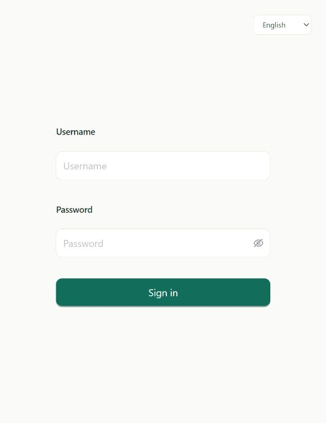
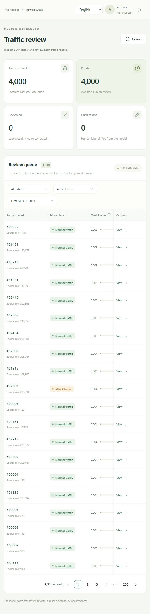
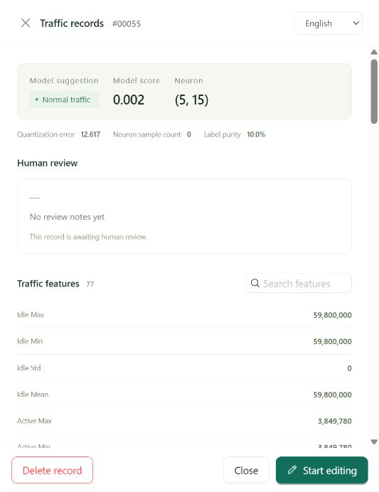
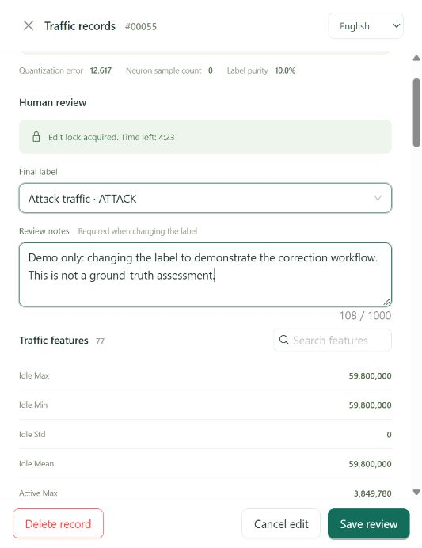

# Runtime screenshots

Captured on Windows on **2026-10-03** from the source included in this repository. All screenshots use English. The application also supports Japanese and Chinese; both language switches were checked while preserving an in-progress review draft.

The web demonstration used its own database, with the app at `127.0.0.1:8089` and MySQL at `127.0.0.1:3308`. The normal setup defaults remain `8088` and `3307`.

## 1. Login

The login screen has username and password inputs and a language selector. Passwords are generated locally during setup and are not included in this repository.

## 2. Review queue

The SOM preparation job used 1,000 labeled seed rows and created 4,000 review candidates from the included sample. The queue can be filtered and sorted by model score.

## 3. Record details

The drawer shows the model label, heuristic score, neuron information, and 77 traffic features.

## 4. Edit lease and label correction

Starting an edit obtains a five-minute lease. The screenshot shows the remaining time, a changed human label, and a review note. A note is required when changing the model's label.

## 5. Saved review

After saving and reopening the record, the application shows the human label, reviewer, note, and timestamp. The model label remains available separately.

The demonstrated change on record `55` is a **workflow example**, not a ground-truth assessment of that traffic. Its note says so explicitly. This demonstration database is not distributed; a fresh setup starts with unreviewed candidates.

## 6. PCAP extraction

The synthetic PCAP contains eight packets and produces two data rows with 84 columns. Both rows receive `NeedManualLabel`. The retained upstream console counter reports three CSV lines because it includes the header.

This screenshot shows a browser report generated from the actual CLI output and emitted CSV. The report is a presentation of the results, not a built-in graphical screen of the command-line extractor.

- [Captured command and stdout/stderr](pcap-run.txt)
- [HTML report](pcap-run.html)
- [Generated sample CSV](../pcap-extractor/examples/sample-flow.csv)
- [Synthetic packet generator](../pcap-extractor/examples/generate_sample.py)

The run selected an English Java locale and UTF-8 output using the `JAVA_TOOL_OPTIONS` recorded in the log. Timestamp text can otherwise follow the machine's default Java locale and timezone.

## Verification performed

- The extractor built successfully, including its pinned-source hash verification and 14 existing compatibility checks.
- The synthetic PCAP was processed successfully; the CSV schema and row count were inspected.
- The frontend passed TypeScript compilation and a Vite production build.
- The Spring Boot backend built, started, and served the frontend and API.
- The SOM job inserted 4,000 candidates into the isolated database.
- Login, edit-lease acquisition, label correction, persistence after reopening, and all three UI languages were checked in the browser.

This records a local demonstration run, not a production load or security certification.
